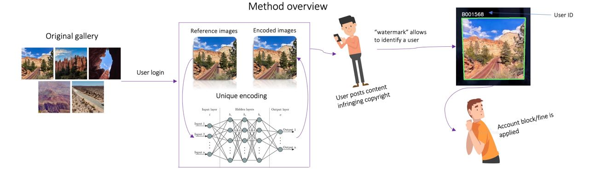

# Digital rights management (DRM) on steroids

## Overview

Introducing a cutting-edge project that utilizes the power of steganography to crack down on copyright violators. Our solution uses advanced image techniques to embed unique digital signatures within protected content. These signatures are undetectable to the human eye and ear, but can be used to track the distribution of the content on unauthorized platforms.

Our system can quickly scan the web, social media, and peer-to-peer networks to identify instances of copyright infringement. Once an infringement is detected, our system will use the embedded signature to trace the content back to the source, allowing copyright holders to take legal action against the violator.

With its ability to accurately and efficiently detect copyright violations, our steganography-based solution offers a comprehensive approach to protecting intellectual property rights in the digital age. So, whether you're a content creator, publisher, or simply concerned about the protection of your creative work, our project is the solution you need to safeguard your rights and profits.

## Code structure

 - backend folder contains code related to backend of the UI and StegaStamp util
 - frontend folder contains code related to UI part

Project contains two parts: the first part simulates a streaming platform
where user can create an account and browse images similar to watching
shows and movies on streaming platforms. Each image in the gallery is watermarked with
an identification information linked to the user.

The second part contains an app running on [HuggingFace platform](https://huggingface.co/spaces/edosedgar/stegastamp_extract)
where a copied content could be uploaded to trace down the user distributed the media.

## Acknowledgment

The system is based off the [StegaStamp](https://github.com/tancik/StegaStamp) paper.

